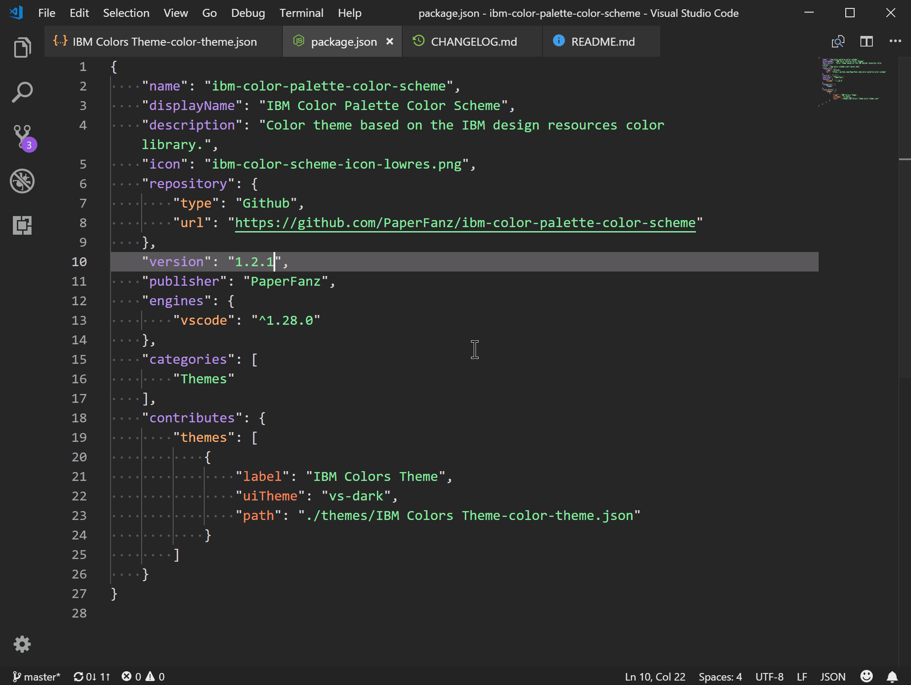
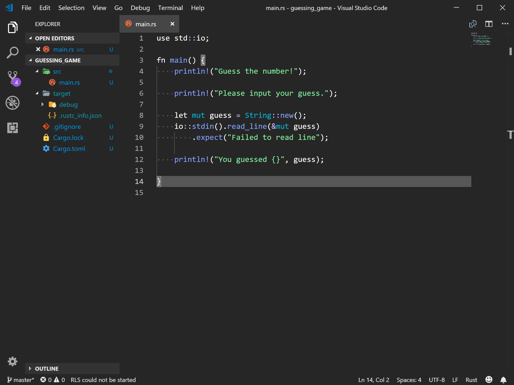
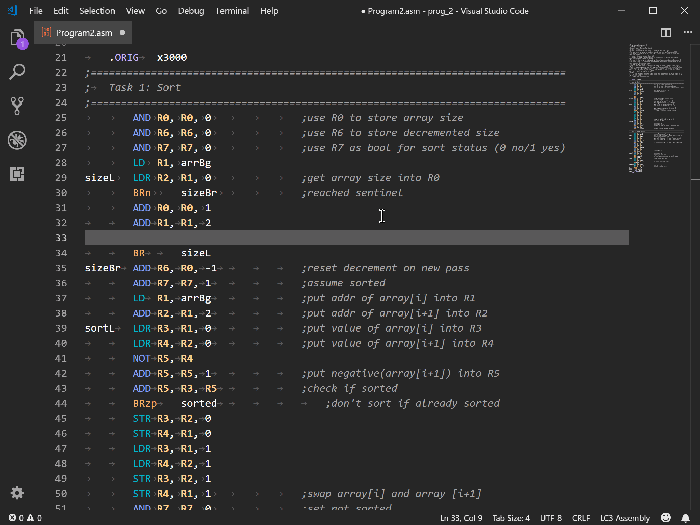

# IBM Color Scheme - Dark Only (for now)

A dark color theme created based off of the IBM design language color library, found [here](https://www.ibm.com/design/language/resources/color-library/).

Do note that the forground elements are fairly bright because I seem to be going blind at the ripe old age of nineteen.

## Screenshots

Editing the colorscheme source code using the theme, and showing off the sidebar tabs:

Rust syntax highlighting:

LC3 assembly syntax highlighting and snippets, extenstion [here](https://marketplace.visualstudio.com/items?itemName=PaperFanz.lc3-assembly):

**Enjoy!**
